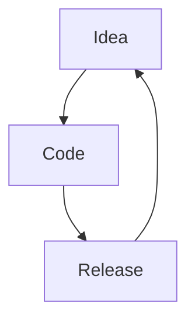

<!-- markdownlint-configure-file { "MD024": { "siblings_only": true } } -->

# Day 17 - Performance metrics

How a _model_ is judged.
How well a ML model can perform a task.

## Model lifecycle



## Baseline score

You need a basis for comparison.

- **Classification**: Predicts a _random_ or _most frequent_ class.
- **Regression**: Predicts a central tendency (_mean_, _median_ or _mode_)

A Dummy model can be used.

```py
from sklearn.dummy import DummyRegressor
baseline_model = DummyRegressor(strategy="mean") # Baseline
```

## Regression metrics

- Ground truth
- Prediction
- Residual (distance between Ground truth and prediction)

### Mean Squared Error (MSE)

Squared difference between ground truth and predicted values

- Useful to penalize large errors
- No sense of direction (squared)
- Not expressed in same units as the target
- Very _sensitive to outliers_

When to use:

- Direction does not matter
- Outliers to be penalized

### Root Mean Squared Error (RMSE)

$$MSE = \dfrac{1}{n}\sum^n_{i=1}(y_i - \hat y_i)^2$$

When to use:

- The error is represented in the unit of the target.

### Mean Absolute Error (MAE)

Absolute Differences between true values and predicted values.

- Less sensitive to outliers.

When to use:

- You do not want to penalize outliers.

### Max Error (ME)

$$ME = \max^{n}_{i=1}|y_i - \hat y_i|$$

Biggest error made by prediction

When to use:

- To limit the magnitude of errors

There is no standardized values for MSE, RMSE, MAE. The scores are relative to the magnitude of the units in the dataset.

### Coefficient of determination $R^2$

Proportion of the variance.
Optimal score of 1.

$$R^2 = 1 - \dfrac{\sum^n_{i=1}(y_i - \hat y_i)}{}$$

👉 Use _MSE_ when you need to penalize large errors.
👉 Use _RMSE_ when you want to penalize large errors, but see it in the unit of the target.
👉 Use _MAE_ when all errors, large or small, have equal importance.
👉 Use _Max Error_ when you want to limit the magnitude of the errors.
👉 Use _R2_ as a general metric to compare performance across different datasets.

## Classification metrics

There are two ways to have a correct prediction:

- True positive
- True negative

There are two ways to have an incorrect prediction:

- False positive
- False negative

### Confusion matrix

|                               | Predicted :x: | Predicted :white_check_mark: |
| :---------------------------: | ------------- | ---------------------------- |
|        **Actual** :x:         | TN            | FP                           |
| **Actual** :white_check_mark: | FN            | TP                           |

Accuracy is the percentage of good predictions:
$acc = \dfrac{TP+TN}{TP+TN+FP+FN}$

We should only use accuracy when:

- Balanced classes
- Prediction of each class is equally important.

### Recall

Ability of a model to detect occurences of a class.

$recall = \dfrac{TP}{TP+FN}$

Important to identify as many occurences of a class as possible.
Useful for avoiding FN.

### Precision

Ability of a model to avoid false occurences of a class.

$recall = \dfrac{TP}{TP+FP}$

Useful for avoiding FP.

### $F_1$ score

Combination of precision and recall

$F_1 = 2\dot\dfrac{prec x recall}{prec+recall}$

`Harmonic mean` of precision and recall.

When to use:

- General metric across models and datasets

We must pick metrics that suit our task.

### Precision-Recall tradeoff

Inverse relationship between precision and recall
The _precision_recall_curve_ lets us compare precision and recall across a variety of thresholds.

### ROC-AUC (Receiver operating characteristic - Area under curve)

Summarizes the tradeoff between two metrics using different thresholds.

$true positive rate = recall = sensitivity = \dfrac{TP}{TP+FN}$
$false positive rate = (1- specificity) = \dfrac{FP}{FP+TN}$

#### AUC (Area under curve)

Indicator of overall performance.
The larger the greater performance.

AUC is not dependent on a chosen threshold.

## Error analysis

Iterative process for identifying common themes within our model's mistakes

## K-Nearest Neighbours (KNN)

Non-linear distance based model capable of solving `Regression` and `Classification` tasks

- Looks at `K` closest samples to make the prediction

1. Calculates distance from sample
2. Takes the closest `K`
3. Majority vote for `Classification`
4. Mean value for `Regression`

### Choosing $k$

$K = 5$ is default

Lower `K` is prone to overfitting.
Higher `K` is prone to underfitting.

Changing `K` might change the prediction.
