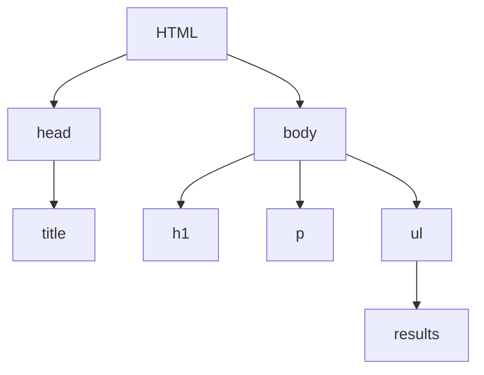

<!-- markdownlint-configure-file { "MD024": { "siblings_only": true } } -->

# Day 2 - Data sourcing

## Finding data

### CSV

Comma-separated values.
Plain text file where each value is separated by a _delimiter_, usually commas.
Each line is a new _record_

[CSV examples web](https://people.sc.fsu.edu/~jburkardt/data/csv/csv.html)

#### CSV Reading in Python

```py
import csv

with open('data/addresses.csv') as csvfile:
    reader = csv.reader(csvfile, skipinitialspace=True)
    for row in reader:
        # row is a `list`
        print(row)
```

`csv` has to be imported.
First we open the file and assign it to `csvfile`.
The we read the contents with the `reader` method.
The option `skipinitialspace` trims whitespaces in the beginning.

#### CSV's with headers

First row contains headers with data titles.
They can be used for the data to be easier to access.

```py
import csv

with open('data/biostats.csv') as csvfile:
    reader = csv.DictReader(csvfile, skipinitialspace=True)
    for row in reader:
         # row is a collections.OrderedDict
        print(row['Name'], row['Sex'], int(row['Age']))
```

File is opened the same way. But is parsed as a `dict`using the method `csv.DictReader`

#### Writing CSV's

```py
import csv

beatles = [{
    'first_name': 'John',
    'last_name': 'lennon',
    'instrument': 'guitar'
}, {
    'first_name': 'Ringo',
    'last_name': 'Starr',
    'instrument': 'drums'
}]

with open('data/beatles.csv', 'w') as csvfile:
    writer = csv.DictWriter(csvfile, fieldnames=beatles[0].keys())
    writer.writeheader()
    for beatle in beatles:
        writer.writerow(beatle)
```

We open a file in the _write_ mode using parameter `w` in `open`.
It is written as a `dict` using the method `csv.DictWriter`
We need to specify if we use _headers_ in `fieldnames` option.
In this case the `keys()` of the first row (all rows have the same keys).
Then write headers with `writer.writeheader()`.
The iterate the Beatles object and write each dictionary entry as a row.

### API

Interface for communication protocol.
It uses http, which is a client-server protocol based on a request/response cycle.

Can be used doing a `GET` or `POST` request. It sends back a `JSON` file.

[Free API library](https://github.com/public-apis/public-apis)

Module `request` has to be imported and used. [Request documentation](https://pypi.org/project/requests/)

Basic request:

```py
import requests

url = 'https://api.github.com/users/ssaunier'
response = requests.get(url).json()

print(response['name'])
```

A `url` has to be passed as an argument of the request.
The the response is parsed to `JSON` using the `.json()` method.

Parameters can be passed inside the `url`.
For example:

```py
import requests

isbn = '0-7475-3269-9'
key = f'ISBN:{isbn}'

response = requests.get(
    'https://openlibrary.org/api/books',
    params={'bibkeys': key, 'format':'json', 'jscmd':'data'},
).json()

print(response[key]['title'])
```

Where we send `bibkeys`, `format` and `jscmd` arguments.

### Web scraping

Get data from any `HTML` web page.
`HTML` is unstructured data. It can be inspected using the `Inspect element` of a browser.



```html
<p class="important">This is a paragraph</p>
<!-- <tag attribute="value">content<closingtag> -->
```

#### Beautiful soup

```py
import requests
from bs4 import BeautifulSoup

response = requests.get(url)
soup = BeautifulSoup(response.content, "html.parser")

# You now can query the `soup` object!
soup.title.string
soup.find('h1')
soup.find_all('a')
```

Get response from `requests` module.
Parse `html` code with _beautiful soup_

- Search for an element:

```html
<p>A paragraph</p>
<article>An article...</article>
<article>Another...</article>
```

```py
paragraph = soup.find("p") # Returns the first p
articles = soup.find_all("article") # Returns a list of all articles
```

- Search by id

```html
<a href="https://www.lewagon.com" id="wagon">Le Wagon</a>
```

```py
item = soup.find(id="wagon")
```

- Search by class

```html
<ul>
  <li class="pizza">Margharita</li>
  <li class="pizza">Calzone</li>
  <li class="pizza">Romana</li>
  <li class="dessert">Tiramisu</li>
</ul>
```

```py
items = soup.find_all("li", class_="pizza")
```

**Note** the underscore in `_pizza`
